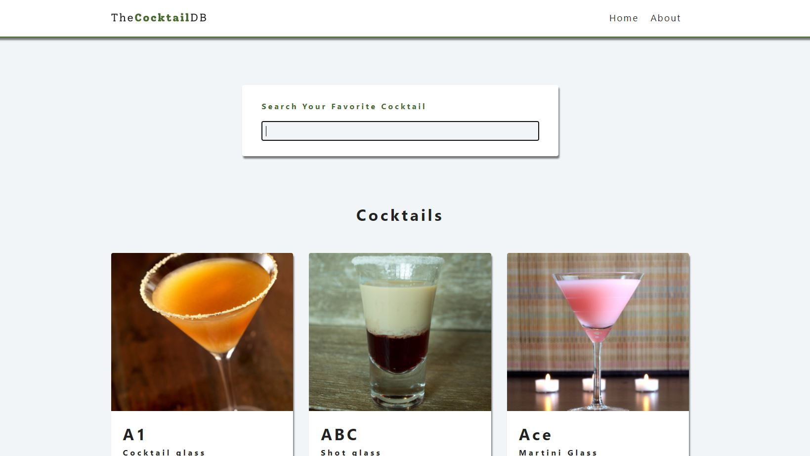
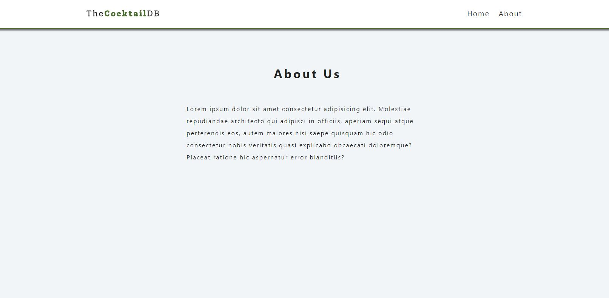
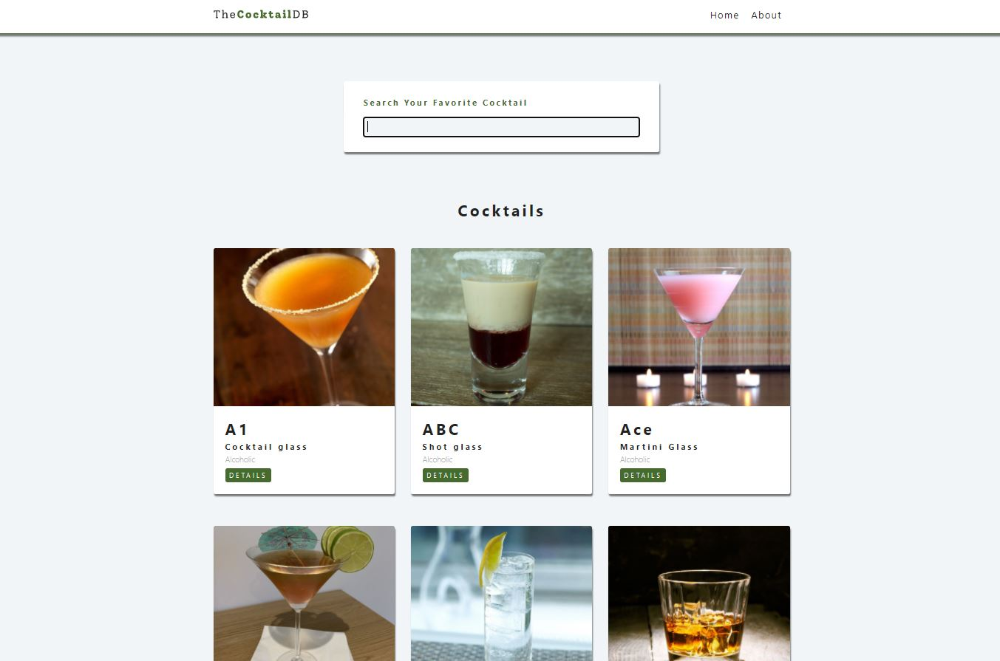

### Developed Restaurant Drinks Website Using HTML, CSS, and React JavaScript ### 
### This Restaurant Website has a search engine to filter menu items, separate pages to show information about the drink items, and a health page ###
### Used React Routers to navigate through different pages in this Restaurant Website ###
### Used Separate Drinks DB API to get Drinks images and information ###
### Sample similar website images are shown below and in samplewebsiteimage.jpg, samplewebsiteimage2.jpg, and samplewebsiteimage3.jpg files above ###

